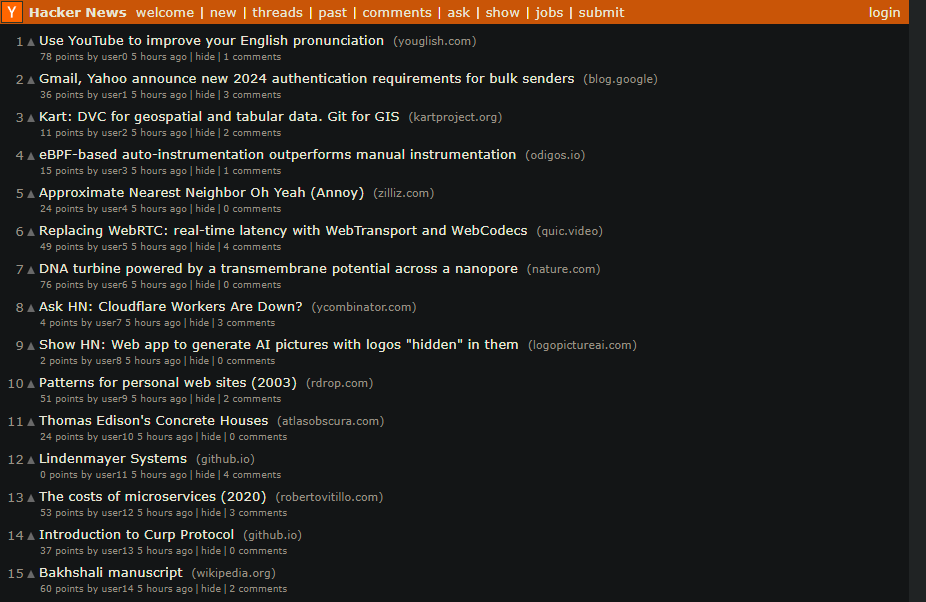

# rss-parser-demo

Simple clone of the front page of hacker news using RSS as the data source, built with React, Typescript, and rss-parser.

Loads the top 30 stories, minimal functionality but the title links work.

Will only work locally, the permissions process is simple, just visit (https://cors-anywhere.herokuapp.com/corsdemo) and clickc the button to request access, I believe it's a 24 hour access token. I've loaded a fallback feed just for demo purposes.

Just a demo - will not be building this out further.

